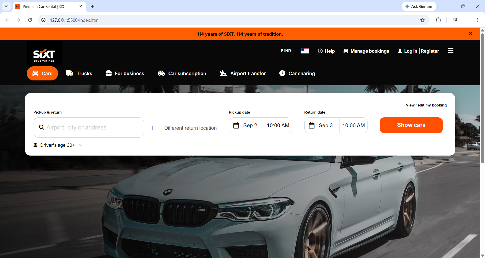
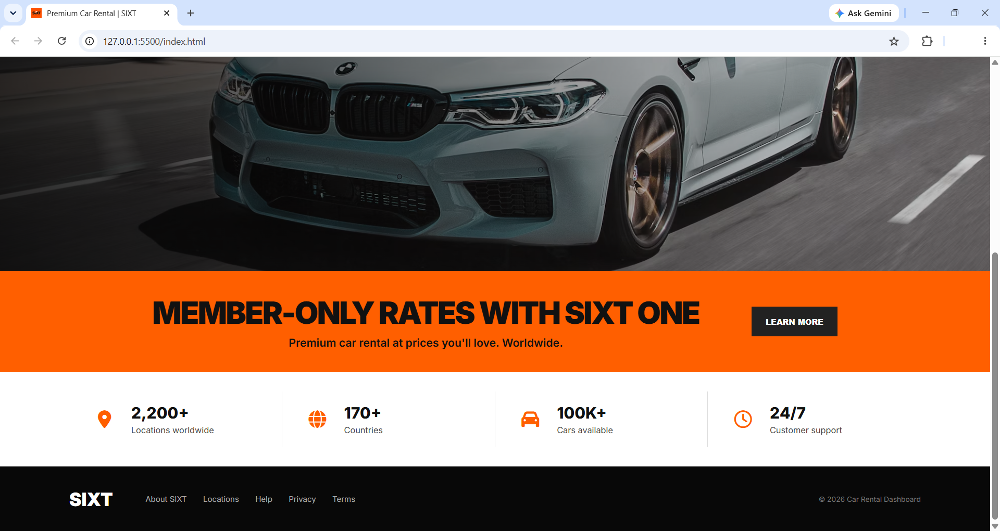

# Sixt-Car-Rental-Dashboard
A modern and responsive car rental booking dashboard inspired by the SIXT rental experience, built with HTML5, CSS3, and JavaScript.

# Live Demo

[View Live Demo](https://purvakale16.github.io/Sixt-Car-Rental-Dashboard/)

# Project Preview

## Desktop View

# Features

*  Modern car rental booking interface
*  Pickup and return location selection
*  Different return location option
*  Interactive date picker
*  Pickup and return time selection
*  Driver age selection and validation
*  Show Cars functionality
*  Dismissible announcement bar
*  Interactive navigation categories
*  Fully responsive design
*  Smooth scrolling and interactive UI elements

# Technologies Used

* **HTML5** – Website structure
* **CSS3** – Styling, layout and responsive design
* **JavaScript** – Dynamic functionality and form validation
* **Font Awesome** – Icons
* **Google Fonts (Inter)** – Clean and modern typography

# Main Sections

## Navigation Bar

Includes SIXT branding, rental categories, currency, help, booking management, account options and menu.

## Rental Categories

Includes Cars, Trucks, For Business, Car Subscription, Airport Transfer and Car Sharing.

## Booking Form

Users can select:

* Pickup location
* Return location
* Pickup date
* Return date
* Pickup time
* Return time
* Driver age

## Interactive Calendar

A custom JavaScript calendar allows users to select dates, navigate between months and validate pickup and return dates.

## Form Validation

The booking form validates important details before proceeding with the **Show Cars** option.

# Responsive Design

The dashboard is designed to work across:

* Desktop
* Laptop
* Tablet
* Mobile

# JavaScript Functionality

JavaScript is used for:

* Custom calendar
* Date validation
* Driver age validation
* Booking form validation
* Rental category switching
* Different return location toggle
* Announcement bar interaction
* Smooth scrolling
* Interactive buttons

# Project Objective

The objective of this project is to create a professional, real-world inspired **car rental booking interface** while developing practical skills in frontend development and JavaScript.

# What I Learned

* Responsive web design
* HTML5 structure
* CSS Flexbox and Grid
* JavaScript DOM manipulation
* Form validation
* Custom calendar development
* Date handling
* Interactive UI development
* Responsive layouts

# Author

**Purva Kale**

B.Tech IT Student | Java Full Stack Developer

# Copyright & Usage

This project is created for **educational and portfolio purposes**.

The design is inspired by SIXT, while the code and implementation are independently developed.

**Please do not copy, reproduce, modify, or redistribute this project's source code without permission.**
